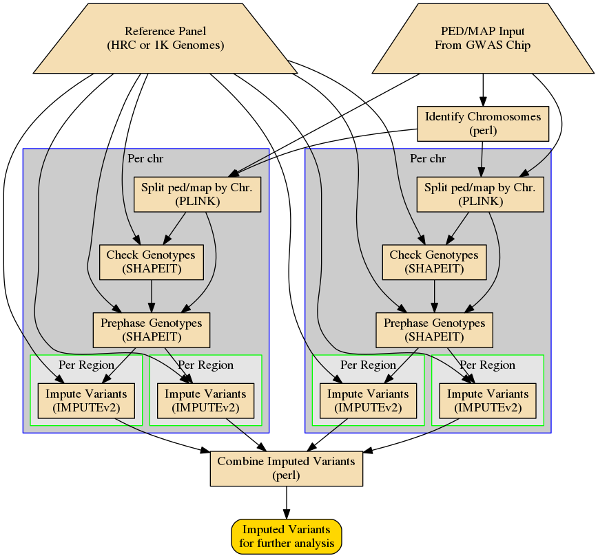

# Imputation Workflow

This repo contains the workflow which was developed as part of
the H3ABioNet Hackathon held in Pretoria, SA in 2016. We track our open tasks using github's [issues](
https://github.com/h3abionet/chipimputation/issues). The 1000ft view is located on
[our Trello board](https://trello.com/b/Dp08chq7/stream-d-imputation-and-phasing).

[//]: # ( -- this is how you make a markdown comment )
[//]: # ( TODO: update workflow diagram )
[//]: # ()

## Setup

#### Headnode
  - [Nextflow](https://www.nextflow.io/) (can be installed as local user)
   - Note that we've experienced problems running Nextflow with it's NXF_HOME on an NFS mount.
   - NXF_HOME needs to be set to this
   - NXF_HOME needs to be in the PATH
  - Java 1.8+

#### Compute nodes
- access to shared storage for input, references, results
- Impute2
- PLINK 1.9+
- vcftools
- Eagle

## Getting started
 1. Clone the repo
 2. Run the test imputation
```
nextflow run imputation.nf -C imputation_nf.test.config
```
 3. check for results in `outfolder`

----

# Using this imputation workflow (on Openstack)

To utilize this workflow, you will have to follow the following
process:

1. Deploy a small node to configure the shared filesystem and download
   reference material
2. Configure a persistent, shared filesystem which will store the
   results of the imputation as well as the reference material.
2. Download the imputation reference panels (see instructions below).
3. Destroy the configuration node (optional)
3. Deploy the VMs to run the imputation calculations
4. Log into the manager node of the deployed VMs and run the
   imputation workflow
5. Wait
6. Examine results of the workflow

## Deploying a configuration node

Deploy a small node (configuration node) which will be used to
configure the shared filesystem and download reference material before
deploying the nodes.

This can be done on openstack using:

`nova boot --flavor m1.small --key-name 'yourkey' configurationnode`

after you have loaded the OpenStack RC file into your shell's
environment and submitted an appropriate ssh key.

## Persistent, shared filesystem

The persistent, shared filesystem will store the results of the
imputation as well as the reference material. This should be a block
store which can be mounted on one of the imputation nodes.

If you are using openstack, this persistent filesystem can be created
using `nova volume-create 100G`. You can then associate the blockstore
with the previously spawned node, ssh into the spawned node (`nova ssh
configurationnode`) and run `sudo mkfs.ext4 /dev/vdb` (or similar) to format
the block store and run `mkdir -p /srv/imputation; mount /dev/vdb
/srv/imputation` to mount the newly formatted blockstore.

*NB: running* `mkfs.ext4` *will destroy all of the information on this
 block store; be careful before running this command.*

Make note of the id of the shared blockstore so that it can be mounted
on the head node of the cluster that you will deploy later.

## Imputation Reference Material

The built in IMPUTEv2 reference panels can be obtained ssh'ing into
the configuration node just created by running

    mkdir /srv/imputation/refdata;
    (cd /srv/imputation/refdata;
     wget https://mathgen.stats.ox.ac.uk/impute/1000GP_Phase3{,_chrX}.tgz
     for a in 1000GP_Phase3{,_chrX}.tgz; do tar -zxf $a; done;
     rm -f 1000GP_Phase3{,_chrX}.tgz;
     mv *chrX* 100GP_Phase3/;
    );

If you are using another directory location, you will need to change
the paths located above and the nextflow configuration file
appropriately.


## Destroy the configuration node

You can remove the configuration node at this point with `nova delete
configurationnode`.

## Deploy VMs for imputation

At this point, you should deploy the VMs that will be used for
imputation.

If you are using OpenStack, you can simply `cd openstack;
./generate_openstack` to generate a fleet of 5 computational nodes and
3 smaller management nodes.

If not, you can use the cloud-init configuration scripts to generate
the necessary configuration on AWS or another cloud provider.

## Run Imputation


You can log into the manager0 node (`nova ssh manager0) and run the
imputation (or any other nextflow based workflow) with

     NXF_EXECUTOR_CPUS=100 /srv/imputation/nextflow/nextflow run -qs \
     1000 -ps 1000 run.nf -with-docker \
     'quay.io/h3abionet_org/impute2:latest' -c ../docker_nextflow \
     -with-timeline foo.html -with-dag foo.png \

### Run imputation locally

You can alternatively run the imputation locally with something like this:

     nextflow ./impute2.nf --chr chr7 --begin 0 --end 2e6 --refdir /srv/imputation/refdata

## Sample data

Sample data for imputation can be generated using the
`generate_testdata.pl` in the data subdirectory by subsetting the
imputation reference panels and then imputing against them.

## Examine results


#
